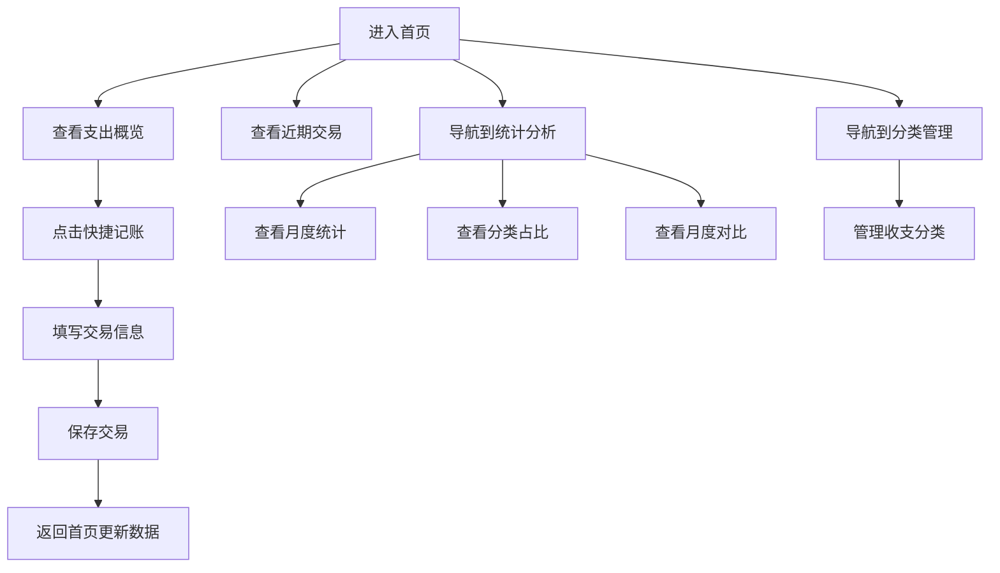

## 1. 产品概述

一款简洁优雅的个人记账软件，帮助用户记录日常消费、查看月度统计、对比不同月份的支出情况，并通过数据可视化分析优化消费习惯。

- **主要目的**：让用户清晰了解自己的消费情况，通过数据对比发现消费规律，从而优化消费习惯
- **目标用户**：所有希望管理个人财务的用户，尤其是关注日常开销的年轻人
- **市场价值**：提供直观的数据可视化，帮助用户做出更明智的财务决策

## 2. 核心功能

### 2.1 用户角色
| 角色 | 注册方式 | 核心权限 |
|------|----------|----------|
| 普通用户 | 本地存储，无需注册 | 记录收支、查看统计、对比分析、管理分类 |

### 2.2 功能模块
1. **首页仪表盘**：当月支出概览、快捷记账入口、近期交易列表
2. **记账页面**：记录收入/支出、选择分类、添加备注、设置日期
3. **统计分析页面**：月度统计、分类占比、月度对比、消费趋势图表
4. **分类管理页面**：查看和管理收支分类

### 2.3 页面详情
| 页面名称 | 模块名称 | 功能描述 |
|----------|----------|----------|
| 首页仪表盘 | 支出概览 | 显示当月总收入、总支出、结余，使用醒目的卡片展示 |
| 首页仪表盘 | 快捷记账 | 一键快速记录支出，支持金额、分类、备注输入 |
| 首页仪表盘 | 近期交易 | 展示最近10条交易记录，支持按时间倒序排列 |
| 记账页面 | 交易表单 | 选择收支类型、输入金额、选择分类、填写备注、设置日期 |
| 统计分析页面 | 月度统计 | 柱状图展示月度支出趋势 |
| 统计分析页面 | 分类占比 | 饼图展示各分类支出占比 |
| 统计分析页面 | 月度对比 | 对比不同月份的支出数据 |
| 分类管理页面 | 分类列表 | 查看所有分类，支持添加、编辑、删除分类 |

## 3. 核心流程

用户登录后首先看到首页仪表盘，了解当月财务状况。需要记账时点击快捷记账按钮或导航到记账页面，填写交易信息后保存。用户可以在统计分析页面查看月度统计、分类占比和月度对比，帮助分析消费习惯。

## 4. 用户界面设计

### 4.1 设计风格
- **主色调**：深蓝绿色系（#0D9488），传达专业、信任、稳定的感觉
- **辅助色**：珊瑚红（#F472B6）用于强调和警示，暖黄色（#FBBF24）用于成功提示
- **按钮风格**：圆角矩形，悬停时有轻微缩放效果
- **字体**：使用 Inter 字体，标题字重 600，正文字重 400
- **布局风格**：卡片式布局，清晰的信息层级
- **图标**：使用 Lucide React 图标库

### 4.2 页面设计概述
| 页面名称 | 模块名称 | UI元素 |
|----------|----------|--------|
| 首页仪表盘 | 支出概览 | 三个卡片并排展示收入、支出、结余，带渐变背景 |
| 首页仪表盘 | 快捷记账 | 浮动操作按钮，点击弹出记账表单 |
| 首页仪表盘 | 近期交易 | 列表式卡片，显示交易图标、名称、金额、日期 |
| 记账页面 | 交易表单 | 表单布局，带分类选择器和日期选择器 |
| 统计分析页面 | 月度统计 | 柱状图，支持月份切换 |
| 统计分析页面 | 分类占比 | 饼图，显示各分类金额和百分比 |
| 统计分析页面 | 月度对比 | 双栏对比卡片，显示同比变化 |
| 分类管理页面 | 分类列表 | 网格布局，每个分类带图标和名称 |

### 4.3 响应式设计
- **桌面端**：完整的多栏布局，所有功能同时展示
- **平板端**：自适应两栏布局
- **移动端**：单栏布局，通过底部导航切换页面

### 4.4 交互设计
- 页面切换使用平滑过渡动画
- 按钮悬停时有缩放和阴影变化效果
- 图表支持交互，点击可查看详细数据
- 记账表单提交时有加载动画