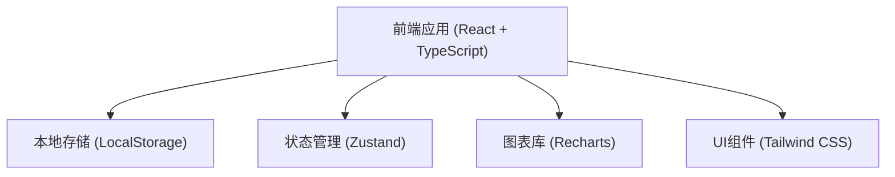
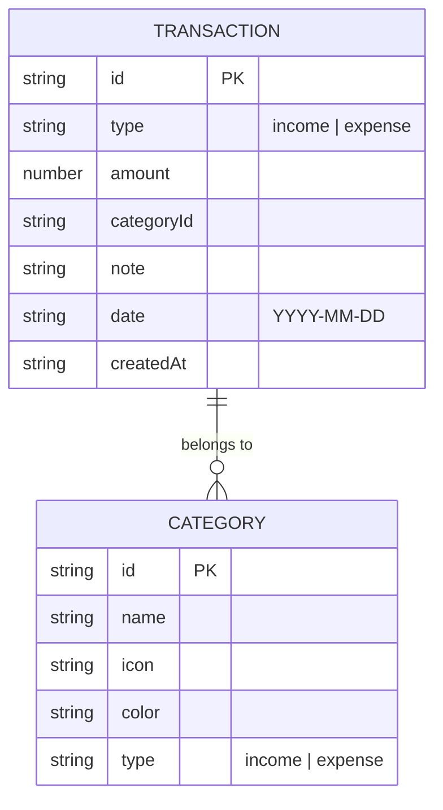

## 1. 架构设计



## 2. 技术选型

- **前端框架**: React 18 + TypeScript
- **构建工具**: Vite 6
- **样式框架**: Tailwind CSS 3
- **状态管理**: Zustand
- **图表库**: Recharts
- **图标库**: Lucide React
- **数据存储**: LocalStorage（本地存储，无需后端）
- **路由**: React Router DOM

## 3. 路由定义

| 路由 | 用途 |
|------|------|
| / | 首页仪表盘，显示当月支出概览和近期交易 |
| /add | 记账页面，记录收入/支出 |
| /stats | 统计分析页面，展示月度统计、分类占比和月度对比 |
| /categories | 分类管理页面，管理收支分类 |

## 4. API定义

本项目为纯前端应用，无需后端API。数据通过LocalStorage进行读写操作。

## 5. 数据模型

### 5.1 数据模型定义



### 5.2 数据结构定义

```typescript
interface Transaction {
  id: string;
  type: 'income' | 'expense';
  amount: number;
  categoryId: string;
  note: string;
  date: string;
  createdAt: string;
}

interface Category {
  id: string;
  name: string;
  icon: string;
  color: string;
  type: 'income' | 'expense';
}

interface MonthlyStats {
  month: string;
  income: number;
  expense: number;
  balance: number;
}
```

### 5.3 初始数据

系统预置以下默认分类：

**支出分类**:
- 餐饮 (🍔, #F472B6)
- 交通 (🚗, #3B82F6)
- 购物 (🛍️, #FBBF24)
- 娱乐 (🎮, #A855F7)
- 住房 (🏠, #0D9488)
- 医疗 (🏥, #EF4444)
- 教育 (📚, #14B8A6)
- 其他 (📝, #6B7280)

**收入分类**:
- 工资 (💼, #22C55E)
- 奖金 (🎁, #F59E0B)
- 投资收益 (📈, #3B82F6)
- 兼职 (💻, #8B5CF6)
- 其他收入 (💰, #6B7280)

## 6. 项目结构

```
src/
├── components/          # 通用组件
│   ├── Layout.tsx       # 页面布局组件
│   ├── Navbar.tsx       # 顶部导航栏
│   ├── BottomNav.tsx    # 底部导航栏（移动端）
│   ├── StatCard.tsx     # 统计卡片组件
│   ├── TransactionCard.tsx  # 交易记录卡片
│   └── CategoryCard.tsx # 分类卡片组件
├── pages/               # 页面组件
│   ├── Dashboard.tsx    # 首页仪表盘
│   ├── AddTransaction.tsx   # 记账页面
│   ├── Statistics.tsx   # 统计分析页面
│   └── Categories.tsx   # 分类管理页面
├── store/               # 状态管理
│   └── useStore.ts      # Zustand store
├── utils/               # 工具函数
│   ├── storage.ts       # LocalStorage操作工具
│   ├── format.ts        # 格式化工具
│   └── mockData.ts      # 模拟数据
├── types/               # TypeScript类型定义
│   └── index.ts         # 类型定义文件
├── App.tsx              # 主应用组件
├── main.tsx             # 入口文件
└── index.css            # 全局样式
```

## 7. 关键技术实现

### 7.1 状态管理

使用 Zustand 管理全局状态，包括交易记录、分类数据和当前选中的月份。状态变更时自动同步到 LocalStorage。

### 7.2 数据持久化

通过 LocalStorage 实现数据持久化，每次状态变更后自动保存。初始化时从 LocalStorage 读取数据，如果没有数据则使用预置的模拟数据。

### 7.3 图表可视化

使用 Recharts 库实现数据可视化，包括：
- 月度支出柱状图
- 分类占比饼图
- 月度对比图表

### 7.4 响应式设计

使用 Tailwind CSS 的响应式工具类实现多设备适配，包括桌面端、平板和移动端布局。